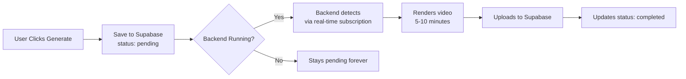

# Video Generation Summary

## Your Current Setup

### 1. Frontend (Vercel) ✅
- Hosts the React app
- Handles AI hook generation via Vercel Functions
- Saves video requests to Supabase

### 2. Backend (NOT on Vercel) ❌
- **Required for actual video rendering**
- Uses Remotion + FFmpeg
- Cannot run on Vercel (timeouts, no video processing)

## How Video Generation Works



## What You Need to Do

### 1. Create Manual User in Supabase
```sql
-- In Supabase SQL Editor, after creating user in Auth
-- Check if profile exists:
SELECT * FROM profiles WHERE id = 'YOUR-USER-ID';

-- If not, create it:
INSERT INTO profiles (id, email, plan, credits)
VALUES ('YOUR-USER-ID', 'demo@example.com', 'free', 999);
```

### 2. Update Code with User ID
In `frontend/src/components/ContentGenerator.tsx` line ~107:
```javascript
const HARDCODED_USER_ID = "YOUR-ACTUAL-USER-ID-HERE";
```

### 3. Choose Backend Hosting

| Option | Cost | Setup Time | Best For |
|--------|------|------------|----------|
| Local Computer | Free | 5 min | Testing |
| DigitalOcean | $6/mo | 30 min | Production |
| Render.com | $7/mo | 15 min | Easy deploy |
| Railway | $5/mo | 10 min | Fastest |

## Without Backend Server

**What works:**
- ✅ All UI features
- ✅ Saves requests to database
- ✅ AI hook generation
- ✅ Carousels

**What doesn't work:**
- ❌ No actual video files created
- ❌ Videos stay "pending" forever
- ❌ Can't download videos

## The Bottom Line

**You MUST run the backend server somewhere** to actually generate videos. Vercel alone cannot do video rendering. The backend:
1. Watches for new video requests
2. Renders them with Remotion
3. Uploads to Supabase storage

Without it, you just have a nice UI that saves requests but can't fulfill them. 